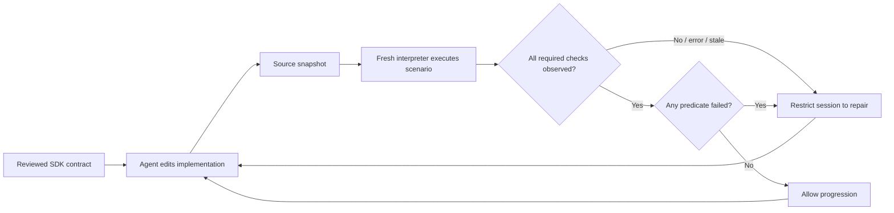

# Keep generated code inside reviewed intent

Melampus 0.1.0 focuses on the **local coding loop**. A dedicated supervisor runs
beside the agent, observes source changes, exercises the actual implementation,
and makes fresh SDK evidence available to synchronous agent hooks. Service
monitoring and broader tracing workflows are later expansion; the OTLP watcher
remains a reusable foundation.

## Registration alternative (0.2.0 development)

For existing services, register reviewed contracts at application setup with
`instrument(service, namespace=..., contracts=...)`, keeping business methods
plain. [SDK registration](SDK-REGISTRATION.md) explains binding, scope and
compatibility; the [runnable comparison](../examples/sdk-registration/README.md)
includes Claude hooks. The original decorator session remains supported.

## What you review, and what the agent writes

1. **Approve intent once.** Put a small set of `Contract` objects in a Python
   module. Each carries intent prose, optional assumptions, and pure synchronous
   `Check` predicates over successful return values. Export `CONTRACTS`, mapping
   exact `module:qualified_name` identifiers to those objects. Use unsampled
   checks. Predicates must express meaningful behavior, not simply return True.
2. **Provide executable inputs.** Write a short scenario that imports real entry
   points and calls them with representative/boundary inputs. Assertions live
   in the SDK contracts; the scenario need not duplicate them as unit tests.
   Review any fixtures and helper modules the scenario depends on too.
3. **Define the scope.** List source files/directories in `watch`. Include every
   local dependency whose changes can affect the scenario, including data/config
   inputs. List reviewed helper files in `protect`. Contract module, scenario,
   and configuration are protected automatically. State the allowed scope in
   the agent's instructions.
4. **Start the supervisor.** Run `melampus session` in a dedicated terminal.
   At startup it pins hashes of reviewed files. Each changed revision starts
   a fresh interpreter, with an always-on tracer and synchronous local evidence
   collection. It runs no LLM and requires no tracing server.
5. **Start the agent with hooks.** The agent imports the approved contract and
   generates functions using `@CONTRACT.instrument()`. The included Claude Code
   settings request current evidence before/after tools and before completion.
   Verify that the hooks are enabled; instructions alone are not enforcement.
6. **Repair immediately on evidence.** A failed predicate identifies its
   function/check and trace reference. Read the contract, repair the watched
   implementation with Edit/Write, and let the supervisor rerun. Only a current
   healthy result permits normal progression. Escalate a mistaken contract or
   three unsuccessful repairs to the owner; never weaken claims to get green.

See the [runnable example](../examples/agent-session/README.md).

## Minimal configuration

`melampus.toml` lives in the project root; paths resolve from that directory:

```toml
contracts = "intent"          # intent.py exports CONTRACTS; a root-level module
probe = "exercise.py"        # calls real entry points with reviewed inputs
watch = ["src", "config.json"]
python_paths = [".", "src"]  # defaults to ["."]
protect = ["fixtures.py", ".claude/settings.json", "CLAUDE.md"]
timeout = 5                  # >0 and <=10 seconds, includes interpreter startup
```

Watched directories are recursive. VCS, virtualenv, Melampus state, bytecode,
and common tool-cache directories are ignored. Prefer a focused source scope
over watching a whole repository with generated assets. All paths stay inside
the project root. The first session implementation supports macOS/Linux.

Start one supervisor per worktree, with a separate state file for each:

```sh
melampus session --config melampus.toml --state .melampus/session.json
melampus gate --state .melampus/session.json
```

The second command queries the live supervisor and returns JSON plus exit
0 (healthy), 1 (drift), or 2 (incomplete). It never trusts a saved green report.
The state file holds a local port and a per-session token, has owner-only
permissions, and is removed on Ctrl-C. A lock prevents two supervisors claiming
the same state file. Stop and restart only after owner review when contracts
or scenarios intentionally change. Different worktrees need independent setup.

## How the loop decides



| Evidence | State | Agent action |
| --- | --- | --- |
| Every required function/check observed; all pass | Healthy / 0 | Continue within the approved scope |
| At least one failed predicate | Drift / 1 | Inspect named contract and repair implementation |
| Missing decorator/function/check, suppression, errors, timeout, stale revision, changed reviewed files, unavailable supervisor | Incomplete / 2 | Repair or request owner help; no success claim |

Incomplete takes precedence over drift. Evidence is scoped to the observed
source revision. Changes during execution invalidate that run. Required checks
cannot be hidden by unrelated passing checks. The runner validates identity of
the reviewed predicate objects at decoration time, not just their names/text.
It uses fresh bytecode paths so quick, same-size edits do not reuse stale imports.

## Claude Code: what is actually blocked

Install the example `.claude/settings.json` entries into your existing settings
without replacing unrelated hooks. Activate the environment containing Melampus
before launching Claude, or use the absolute path to its executable in each
hook command. Keep the hook timeout at 30 seconds; Melampus's client deadline is
25 seconds and each scenario is capped at 10 seconds. Do not use async hooks.

| Hook | Result while drift/incomplete |
| --- | --- |
| `PreToolUse` | Deny shell, delegation, and other progression tools. Allow Read/Grep/Glob/AskUserQuestion and Edit/Write only within watched implementation paths. |
| `PostToolUse` | Return block feedback with evidence so the next action addresses repair. The completed edit has already happened. |
| `PostToolUseFailure` | Inject current repair evidence after a failed tool call. |
| `Stop` | Block successful completion until evidence is healthy. |

Direct Edit/Write outside the watched scope is denied even when healthy. Reviewed
files are never repair targets. A healthy shell command can still change a
protected file; the next observation then marks the session incomplete.

These choices follow the [Claude Code hook protocol](https://code.claude.com/docs/en/hooks).
The integration is a cooperative development guardrail, not a security sandbox.
An agent or user with OS access can disable hooks, tamper with the package,
forge evidence, or restart the session. Hook host timeouts/misconfiguration can
also prevent enforcement; the host's lifecycle remains authoritative. Already
running or parallel tools are not retroactively canceled. Use one coding agent
per scoped worktree for the alpha. The supervisor does not interrupt model tokens
mid-generation; detection begins after a file changes and its scenario executes.

## Other agents and automation

`melampus gate` is the agent-neutral boundary. A controller calls it before
allowing the next operation, after an edit, and before accepting completion:

```text
gate=0 → permit next scoped action
gate=1 or 2 → permit inspection/repair only → edit → gate again
```

That controller must honor the return code, preserve repair access, and feed
the JSON report back to its model. An instruction to "remember to run the gate"
does not guarantee enforcement. Only the Claude Code hook adapter is bundled
in this alpha; no native Codex/other-agent hook integration is claimed.

## How this differs from tests and CI

| Question | Unit/property tests | CI | Melampus local session |
| --- | --- | --- | --- |
| What is it? | Executable assertions about behavior | An orchestrator for checks | An orchestrator for reviewed SDK contracts and repair feedback |
| When does it run? | Whenever invoked, including on every edit | Usually on push/PR; configurable | On watched changes and synchronous agent boundaries |
| Where is expected behavior? | Test oracle/assertions | In tools it invokes | Frozen contract objects imported by generated functions |
| Does it need exercised inputs? | Yes | Depends on its checks | Yes: short scenarios drive real code |
| What stops the agent? | A separate hook/controller | Often only merge gates | Bundled Claude hooks restrict progression until repair passes |
| Can AI produce weak assertions? | Yes | Inherits that weakness | Yes: independent contract/scenario review remains necessary |
| Main strength | Broad, mature correctness techniques | Reproducible team-wide checks | Fast local feedback with checks attached to generated units |
| Main cost | Maintaining assertions and fixtures | Runtime/queue and integration cost | Contract setup, scenario latency, explicit scope, hook integration |

Melampus uses the same fundamental idea of an executable oracle. Existing tests
with good hooks can catch many of the same failures; Melampus does not have a
special ability to know intent. Its contribution is a reusable contract-carrying
SDK plus the local enforcement/repair loop and explicit missing-evidence state.
It reduces duplicate assertion code when the same contract travels with the
function. It does not remove the need to review the oracle, exercise behavior,
or retain valuable tests, static checks, and CI.

Run `python examples/agent-session/compare_with_unit_tests.py` for a controlled
comparison. It demonstrates both sides: contract-equivalent boundary tests catch
the same bad return value when invoked, while removing instrumentation leaves all
behavioral tests green but makes Melampus report incomplete evidence and deny the
next agent action.

## What a green session cannot establish

- Intent prose is descriptive; predicates define the checked claims. A constant
  zero can pass a "nonnegative price" check. Add meaningful approved claims for
  actual pricing correctness; generating more weak checks does not help.
- Required targets must be listed. Unlisted functions, unexercised branches,
  incorrect architecture, readability, dependency bloat, and security issues
  outside the declared checks can remain undetected.
- Checks currently inspect return values only, not call arguments or arbitrary
  side effects. They are ordinary Python code and may themselves be wrong.
- Scenarios run with the user's permissions and inherited environment. Use
  local deterministic fixtures and no production credentials or destructive
  side effects. Timeouts terminate the scenario's process group; deliberately
  detached children and externally started programs are outside supervision.
- Only watched/protected file content changes invalidate cached results.
  External service state, environment changes, and nondeterminism need a new
  session or stronger scenario design. Hashes do not prove complete coverage.

For adoption, start with a few critical generated functions, review their
contracts, seed known bad implementations to prove detection, and measure actual
repair iterations and missed defects. No reduction in review time or defect rate
is claimed without pilot evidence.
